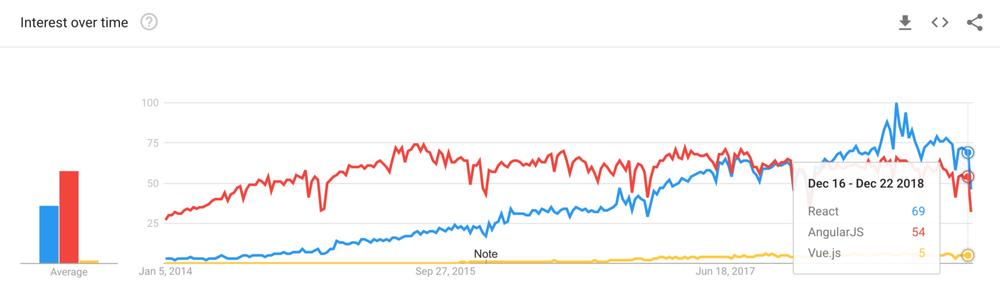
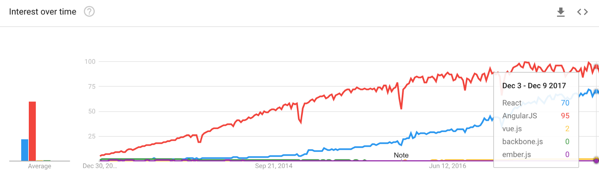
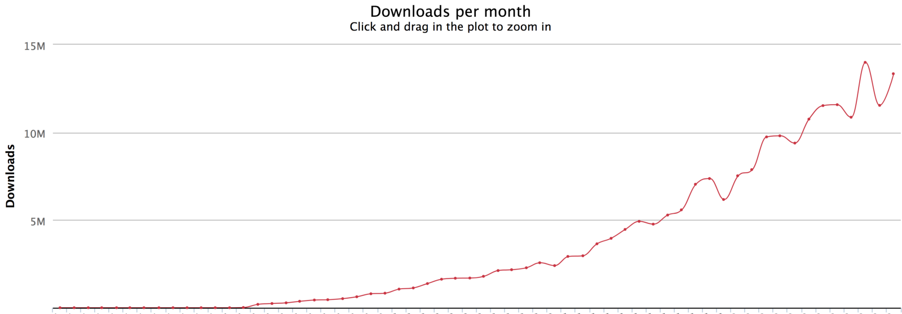
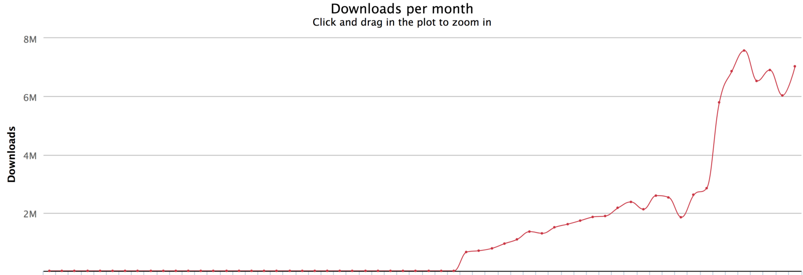
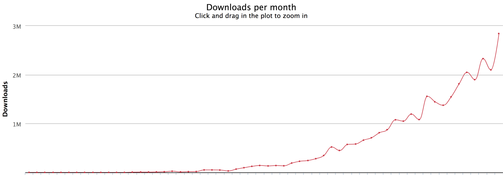
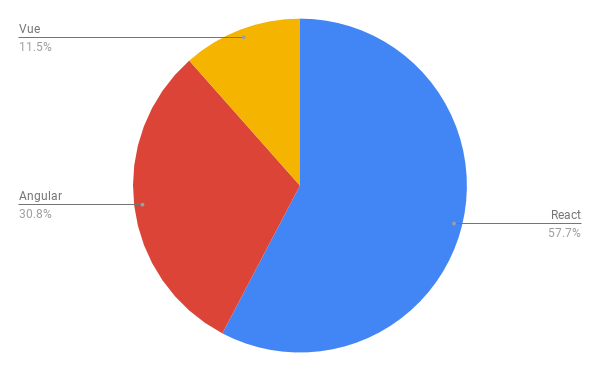
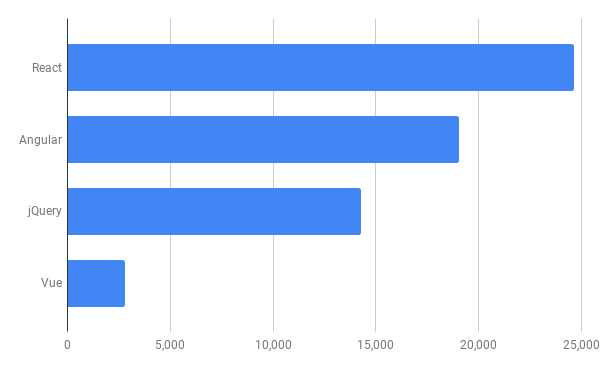
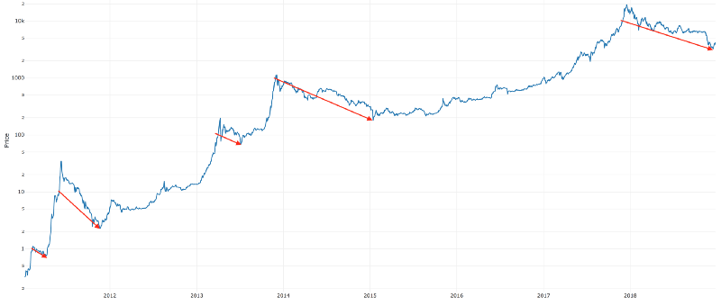

**以下內容翻譯自: [Top JavaScript Frameworks and Topics to Learn in 2019](https://medium.com/javascript-scene/top-javascript-frameworks-and-topics-to-learn-in-2019-b4142f38df20)**

又來到了年度 JavaScript 技術生態回顧了，我們的目標是找出最有投資報酬率的學系主題與技術，哪些框架是大家常用的，又或者未來的趨勢是什麼？我們並不是嘗試找出最好的框架，但我們確實用數據，來幫助你在面試的時候當別人問你 "你知道xxxx嗎?"

我們不會考慮哪一個框架最快，又或者是哪一個框架質量最好，我們假設這些效能都已經很完善了，並且在工作上都已經可以完成需求了，而我們所要關注的是: 到底哪些是最受歡迎的?

## Component Frameworks (元件框架)

現今主流的 Component Frameworks 有三個: React, Angular 和 Vue.js, 主要是因為

去年的時候我關注到 Vue.js 成長得非常快速，並且有可能在2018的時候超越Angular，但這事情並沒有發生，但它依舊是一個成長非常快速的框架，我也發現到說要 React 開發者，轉換到其他框架更加的困難<small>(黏著度比較高啦)</small>，因為整體而言 React 用戶滿意度比 Angular 來得高，開發者並沒有迫切的理由去選擇另外一個框架，所以 React 在去年一樣穩坐了2018的寶座。

### Prediction: React Continues to Dominate in 2019   (預測: React 將繼續會是2019的寶座)

在我們追蹤數據的第三年裡，[React 滿意度依舊高於 Angular](https://2018.stateofjs.com/front-end-frameworks/overview/)，而對照其他的框架，React表現一樣不俗，現階段我也沒有看出有任何可以與它挑戰的在未來的2019裡，除非它發生重大的的變動，不然它將會一樣是2019的最受歡迎的框架之一。

React 正不斷的越來越好，從 React 0.14.版本開始，新的 [React hooks API](https://reactjs.org/docs/hooks-reference.html)把舊有令人詬病的 `class` API 換掉(舊有的 class API 依舊可以用，但推薦使用 hooks API )，React 增加了很多很棒的 API，像是 code splitting 與 concurrent rendering ([詳細](https://reactjs.org/blog/2018/11/13/react-conf-recap.html))，這些毫無疑問的都讓 React 在2019更難被打敗，如果要我推薦一個友善的前端框架給開發者，那麼非它莫屬了。

### Data Sources (數據來源)
我們用以下指標的一部分資料來看
- **Google Search Trends (Google 搜尋趨勢)** 不是我愛好的一個指標性參考，但很適合用於圖表顯示
- **Package Downloads (套件下載量)** 主要是看有多少的人使用這個框架
- **Job board postings from Indeed.com. (工作招聘的指標)**

### Google Search Trends (Google 搜尋趨勢)

React 在2018年1月的時候，搜尋量超越了Augular，並且一路領先到年底，從圖表中的位置可以看到Vue.js，但一樣只有少部分，比較前年的圖表:

### Package Downloads (套件下載)
套件的下載量給予我們較客觀的方式，去看出說到底多少的開發者在使用，因為當開發者需要用到這個套件的時候，就會去下載並且使用。

聰明的你可能注意到，有時候他們會從企業內部的套件庫下載，對於我的回答是“沒錯！這確實發生在這三種框架身上”，在企業裡面他們都各自有立足之地，但我對於這些大數據的平均數很有信心

**React Monthly Downloads: 2014–2018**

**Angular Monthly Downloads: 2014–2018**

**Vue Monthly Downloads: 2014–2018**

我們來看看這三種框架的的下載量比較:

> 你可能會講說，喔！你忘記Angular 1.0 了，現在還是很多企業在使用。

我並沒有忘記它，他就像Window XP 一樣，還是有很多企業在使用，但比起新的版本，舊的版本使用者的數量就相形見絀了，所以我們不用特別針對舊的版本去做比較。

為什麼呢？因為在軟體業使用JavaScript的人或企業不斷的提升，以至於新的版本很容易就取代舊的，除非有些 App 從未更新。

### Job Board Postings (工作上的職缺)

Indeed.com 裡面有各式各樣的職缺，每一年我們從中找出哪一個框架在找招聘人的時候最容易被入取，以下是我們上一年所歸納出來的

- React: 24,640
- Angular: 19,032
- jQuery: 14,272
- Vue: 2,816
- Ember (not pictured): 2,397

比較去年與今年的職缺來說，今年的多了很多，而我拿掉 Ember 主要是因為它的成長已經沒有那麼快速了，我不會推薦它在你未來的工作上， jQuery 與 Ember 在職缺上的變化不大，但除了他們之外，其他的框架成長卻很大。

## JavaScript Fundamentals (JavaScript 基礎)
JavaScript 的基礎，這我已經說了好多年了，今年你將會得到一些幫助，所有的軟體工程師將會朝者把複雜的問題，切割成很多小的問題，然後再把很多小的問題組成一個解決的方案，最後成為你的應用程式。

但每當我在面試的時候問到“what is function composition“ 和 ”what is object composition“ 的時候，大部分的面試者都無法回答這問題，即使他們每天都會碰到。

我覺得這是一個我需要去解決的問題，所以我寫了一本書，書的名稱：[ “Composing Software”](https://medium.com/javascript-scene/composing-software-an-introduction-27b72500d6ea)

### On TypeScript
TypeScript 從2018年就不斷的在成長，而且越來越被重視，因為在 JavaScript 裡面型態並不是一個很嚴謹的東西，而TypeScript 在這方面幫助 JavaScript 提升了很多，你也可以啟用 TypeScript 的型態檢查，在你的 Visual Studio Code 或是安裝 Tern.js 在你喜好的編輯軟體上。

TypeScript 對於大部分的高階函數來說，似乎比較沒那麼好用，也許只是我不知道怎麼樣正確的使用(在使用它幾年的情況下後，他們真的需要提升文黨與可用性)，但我還是不知道怎麼正確的使用 map的 操作在 TypeScript 上，而且在執行上頻繁的跑出錯誤，但並不是真的有錯誤。

對於我自己在軟體上的認知，它還不是那麼的有彈性以及功能上的齊全，因為在我實際用於專案上的時候，的確有些地方讓我蠻沮喪的，但我還是抱著希望有一天它可以增加更多我們所需要的，我很喜歡它在強型別上的淺力，真的很有幫助。

***我目前對TypeScript的評價是: 在部分、有限制性的使用情境下很牛逼，但放到大型商業應用上，反而顯得笨拙，名大於實，且投資報酬率非常的低。很諷刺的，TypeScript對自己的評價是"規模化後的Javascript"。或許他們應該加一句:"詭異的規模化後的Javascript"***

What we need for JavaScript is a type system modeled more after Haskell’s, and less after Java’s.

### Other JavaScript Tech to Learn (其他JavaScript要學的技術)
- GraphQL to query services
- Redux to manage app state
- redux-saga to isolate side-effects
- react-feature-toggles to ease continuous delivery and testing
- RITEway for beautifully readable unit tests

## The Rise of the Crypto Industry (加密技術的興起)
去年的時候我預測在2018年，區塊鏈和金融科技將會是個重大發展的技術，而確實發生，在2017–2018之間，有一個重要的主題，是加密技術的與物聯網的興起，記住這段話，你往後會將會時常聽到這個東西。
 
自從P2P非常熱門之後，如果你有在追蹤分散式資料庫，那麼比特幣很好地展現出加密技術的應用，與如何使用分散式來維持運作，未來發展是銳不可擋的。

比特幣在最近幾年成長飛速，你可能會聽到2018年是"加密貨幣的寒冬"，而且遇到一些麻煩，這完全不合理，從2017年底開始，加密貨幣開始盛行，比特幣的成長曲線一路成長了10x之多，而現在只是拉回正常的狀況，這只是市場的一個效應。

從這張圖表可以看出，每當成長10x以上的指數點，必會反彈回去並且修正。

ICO(首次代幣發行)募資在2018年初達到一個巔峰，並且在2017-2018，資金帶動了整個新產業，2018年1月達到1萬多職缺的巔峰，現在已經恢復到大約2,400，但我們還是認為這產業還只是在初期的階段，而且整個發展才正要開始。

關於新興的加密產業有太多要說，那已經是另外一篇文章了，如果有你興趣，你可以讀
[“Blockchain Platforms and Tech to Watch in 2019”](https://medium.com/the-challenge/blockchain-platforms-tech-to-watch-in-2019-f2bfefc5c23)

## Other Tech to Watch(觀察其它技術)

如去年所預測的一樣，這些技術將會繼續受到關注:

- **機器人工智慧學習**在2018年底，已經如火如荼的開3萬多的職缺，像是 Adobe 企業研究團隊，開發深度學習,難以置信的生成技術,驚人的視頻編輯功能，他們在AI上面應用值得令人興奮。

- **漸進式網頁應用程序(PWA)**將快速地成為現在網頁開發的標準 - 增加了Google，Apple，Microsoft，Amazon等的功能和支持，難以置信PWAs在手機上會有多麽方便，舉個例子: 我再也不用安裝 Twitter 應用程式在我的安卓手機上，我只要有 Twitter PWA 就行了。

- **AR,VR,Mr** 這些所有統合**XR**，未來這些將無所不在，我預測在未來5-10年，將會大規模採用消費模式的XR眼鏡，結合隱形眼鏡，而去年數以萬計的職缺開放，今年這行業將會繼續延展下去。

- **機器人,無人幾,自動駕駛車**，無人機已經有了，自駕車還在開發中，而在2018年底，有更多的自駕車與我們一同在路上，這些科技也將不斷的成長，並顛覆整個世界在 2019，甚至在未來的20年內。 

- **量子計算**
正如我所預料的，在2018，量子計算取得了令人欽佩的進展，現階段還未成未主流，我也非常樂觀的預測，他將會在2019或之前真正的開始。
加密技術的研究員，對量子安全加密算法很關注，儘管在2018年，不斷湧現有趣的研究進展，但最近有一篇文章[提出了一些看法](https://www.theregister.co.uk/2018/12/06/quantum_computing_slow/)。 
這讓我想起早期的AI人工智能，在1980年的時候升溫，在1980～1990取得了一些有限的成就，但卻僅僅在2010的時候，這項技術讓人們感到興奮不已。

**資料來源: [Top JavaScript Frameworks and Topics to Learn in 2019](https://medium.com/javascript-scene/top-javascript-frameworks-and-topics-to-learn-in-2019-b4142f38df20)**

<!-- Javascript 在去年
annual 全年
tech ecosystem 技術生態系統
aim 目標
potential 潛在
ROI 投資報酬率
approach 途徑
land 登陸
in terms of 就...而言
established 既定,公認
foothold 立足之地
enterprise 企業
overrated 被高估
prediction 預測
decentralized 分散
lit the fuse
crypto 加密
magnitude 大小
orders of magnitude 數量級
fundraising 募款
funding 資金
burgeoning 新興
capabilities 功能
industry 行業
reshape 重塑
progressed 進展
admirably 令人敬佩
predicted 預料到的,預測
disruption 瓦解 -->