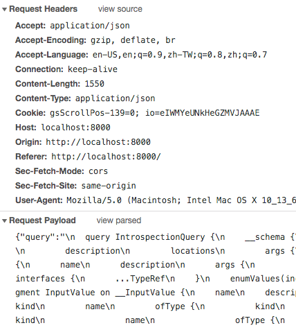

<center><small>apollo graphQL</small></center>
<br>
最近工作上遇到這問題，也花了些時間來研究，圖片上傳相信很多人都有實作過，但如果是要用 graphQL 實作圖片上傳呢，會稍微麻煩一點，一般來說 web 要實作圖片上傳其實並不難，以下有幾種方式可以做選擇。<br>

- **Base64 Encoding**
是一種基於64個可列印字元來表示二進位資料的表示方法，我們可以通過 base64 字串來跟 Graphql server 做溝通，但 base64 編碼文件將比原始二進製文件大了大約33％。

- **FormData**
我覺得這是一個比較好的方法，首先我們要先了解什麼是 FormData ，FormData 是 Web API 提供的一種物件格式，表單的 fields 與 values，對應到物件的 key/value ，利用在 Content-Type 設置 "multipart/form-data"，可以很輕易的在瀏覽器之間做傳遞。

```html
  <input type="file" id="image-upoad" onchange="handleUpload()" />
```

##In GraphQL
GraphQL 主要傳遞資料的方式是把 query data 經由 POST method 放在 body 裡面傳遞給 Server，Server 會再去解析query裡面的資料，而 apollo-link-http 則幫我們統一端口並處理了資料，但並未支援 form-data 格式。🤨


## - Clint([**apollo-upload-client**](https://github.com/jaydenseric/apollo-upload-client)) 👻
瀏覽器預設的 Content-Type 是 application/json，要傳遞 FormData 則需要改成 multipart/form-data，這時就需要 **apollo-upload-client** 來修改端口幫我們實現。
<br>
<br>
我們可以看到 **apollo-upload-client** 是基於 apollo-link 去實現的，主要的是判斷裡面如果有 files 的話就會針對 headers 去做一次修改，並把拿到的內容 append 到 formData。
```javascript
    //....
    const { clone, files } = extractFiles(body)
    const payload = serializeFetchParameter(clone, 'Payload')

    if (files.size) {
      // Automatically set by fetch when the body is a FormData instance.
      delete options.headers['content-type']
      const form = new FormData()
      form.append('operations', payload)
    //....
```
最後再經由瀏覽器原生的 fetch 方法，傳遞資料給 Server
```javascript
    //....
    linkFetch(uri, options)
      .then(response => {
        // Forward the response on the context.
        operation.setContext({ response })
        return response
      })
    //....
```
## - Server([graphql-upload](https://github.com/jaydenseric/graphql-upload)) 👻
在 GraphQL 裡面需要相對應的[**型別**](https://graphql.org/graphql-js/basic-types/)才能把內容連結起來，例如: "Hello" -> "String"，如果和基本型別不符的就需要自定義一個 upload 型別，我們來看看怎麼用 GraphQLScalarType 去自定義。
```javascript
  const typeDefs = `
    scalar Upload
  `
  const resolvers = {
    Upload: GraphQLUpload
  }
  export const schema = makeExecutableSchema({ typeDefs, resolvers })  
  const GraphQLUpload = new GraphQLScalarType({
    name: 'Upload',
    description: 'The `Upload` scalar type represents a file upload.',
    parseValue: value => value,
    parseLiteral() {
      throw new Error('‘Upload’ scalar literal unsupported.')
    },
    serialize() {
      throw new Error('‘Upload’ scalar serialization unsupported.')
    }
  })
```
很不錯的是 graphql-upload 裡面已經幫我們去定義了這個型別了唷 😘。

```javascript
  import { GraphQLUpload } from 'graphql-upload'
```

當 express server 接收到 clint 端 POST data 的時候，我們需要 body-parser 來解析 URL 編碼，但 body-parser 不支援 mutlipart bodies，這時就會想到 express 框架的 [**busboy**](https://github.com/mscdex/busboy) 去做檔案處理，如果不了解也沒關係，graphql-upload 裡面提供了一個 express middleware 讓我們可以很快地去使用。

```javascript
  import express from 'express'
  import { graphqlUploadExpress } from 'graphql-upload'

  express()
  .use(
    '/graphql',
    graphqlUploadExpress({ maxFileSize: 10000000, maxFiles: 10 }),
    graphqlHTTP({ schema })
  )
  .listen(3000)
```

之後就可以在 schema resolve 裡面取得 image stream 的資料囉。

```javascript
  async resolve(parent, { image }) {
    const { filename, mimetype, createReadStream } = await image
    const stream = createReadStream()
  }
```

**資料來源:**<br>
<small>
[- How to manage file uploads in GraphQL mutations using Apollo/Graphene](https://www.freecodecamp.org/news/how-to-manage-file-uploads-in-graphql-mutations-using-apollo-graphene-b48ed6a6498c/)
</small>
<br>
<small>
[- Apollo graphQL 实现文件上传](https://zhuanlan.zhihu.com/p/50117878)
</small>
<br>
<small>
[- [Node.js] express.js + body-parser 處理multipart/form-data的解決方案](https://medium.com/cubemail88/node-js-express-js-body-parser-%E8%99%95%E7%90%86multipart-form-data%E7%9A%84%E8%A7%A3%E6%B1%BA%E6%96%B9%E6%A1%88-d89d2699b9f)
</small>


