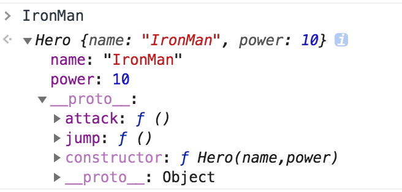
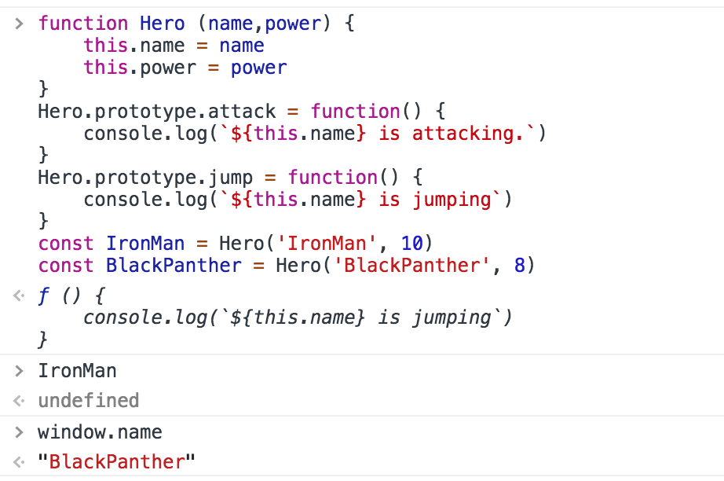
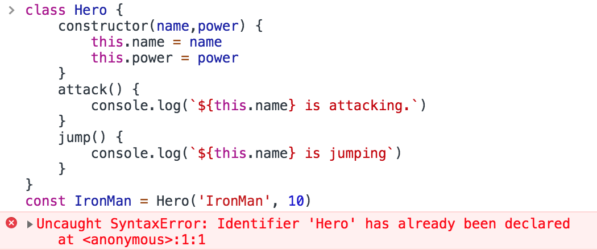
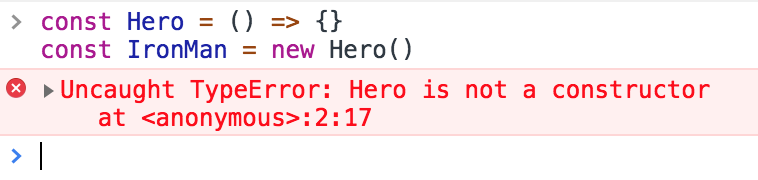

<center><small>Understand JavaScript Prototypes</small></center>
<br>

我們今天來談談在JavaScript裡面跟其他語言很不一樣的東西`prototypal`，為什麼會想要寫這一篇呢？其實就算不懂 prototypal 你一樣可以做開發，現在很多的框架或是ES6都已經包裝越來越好了，但如果你要成為一位資深的工程師，prototypal 你就必須要了解，就像每個家庭主婦都會煮菜，但不是每個家庭主婦都是大廚，如果你要成為一位大廚，就不能只會炒菜跟煮飯(好像扯太遠了XD)。


再講prototypal之前，先來說說物件，在JavaScript裡面物件是個很重要的東西，如果用得好可以幫你省去很多工，如果用不好，那將會是一場災難。

首先我們用最簡單的方式創立一個物件，並且給予一些我們想要屬性。
```javascript
    let hero = {}
    hero.name = 'IRON MAN'
    hero.power = 10
    hero.attack = function(){
        console.log(`${this.name} is attacking.`)
    }
    hero.jump = function() {
        console.log(`${this.name} is jumping`)
    }

    hero.attack() // IRON MAN is attacking
```
恭喜你！我們有了一個鋼鐵人出來，世界獲得了短暫的和平，A few years later...，黑暗勢力慢慢崛起，我們發現只有一隻鋼鐵人沒有辦法守護世界的和平，需要組成一個守護者聯盟，那麼把英雄共同的行為部分給抽出來，並用`function`的包裝，似乎就可以很快的產生出很多不一樣的英雄。
```javascript
    function Hero (name,power) {
        const hero = {}
        hero.name = name
        hero.power = power
        hero.attack = function(){
            console.log(`${this.name} is attacking.`)
        }
        hero.jump = function() {
            console.log(`${this.name} is jumping`)
        }
        return hero
    }
    const IronMan = Hero('IronMan', 10)
    const BlackPanther = Hero('BlackPanther', 8)
```
But...
```javascript
    IronMan.attack === BlackPanther.attack // false 都是獨立的記憶體位置
```
Oh!這似乎不是我們所想要的，為什麼呢？我們知道這些英雄的行為都是動態，並且完全通用的，這代表不需要每次再重新建立的時候，都還要創建一個新的 method，如果今天我們創建了100個英雄角色，那麼這100個英雄角色都會包含這些methods在裡面，這樣會占據相當多的記憶體，只需要讓每個 hero 都去 reference 同一個物件就好。
```javascript
    const heroMethods = {
        attack() {
            console.log(`${this.name} is attacking.`)
        },
        jump(){
            console.log(`${this.name} is jumping`)
        },
        // If I add fly method,
        // fly(){
        //     console.log(`${this.name} is flying`)
        // }
    }
    function Hero (name,power) {
        const hero = {}
        hero.name = name
        hero.power = power
        hero.attack = heroMethods.attack
        hero.jump = heroMethods.jump
        // I also have to adding this line 
        hero.fly = heroMethods.fly
        return hero
    }
    const IronMan = Hero('IronMan', 10)
    const BlackPanther = Hero('BlackPanther', 8)
    IronMan.attack === BlackPanther.attack // true 都共用同一個記憶體位置
```
### Object.create
>Object.create allows you to create an object which will delegate to another object on failed lookups

看起來還不錯，但有個問題，例如當我們要再為 Hero 增加新的飛行技能的時候，就要在 Hero 那邊再加一行`hero.fly = heroMethods.fly`上去，這樣顯得不是很方便，如果可以把這些屬性加到物件的原型上，這樣物件彼此之間就可以互相共用了，而`Object.create` 可以幫我們完成這件事情，建立一個新的物件，並把屬性繼承到新的物件原型上，然後返回給我們，用 Object.create 來改寫看看吧。
```javascript
    const heroMethods = {
        attack() {
            console.log(`${this.name} is attacking.`)
        },
        jump(){
            console.log(`${this.name} is jumping`)
        },
    }
    function Hero (name,power) {
        const hero = Object.create(heroMethods)
        hero.name = name
        hero.power = power
        return hero
    }
    const IronMan = Hero('IronMan', 10)
    const BlackPanther = Hero('BlackPanther', 8)
```

### Prototypal Instantiation

Ｗow～這下可以拍復仇者聯盟無限續集了，但還是有一些地方可以做小小的改進的，為了要能互相共用這些屬性，卻要去單獨維護一個 "heroMethods" 聽起來有不太合理，那有沒有更好的方法可以達成我們所要的呢？
有，那就是 `prototype`

**prototype and \__proto__**

- \__proto__ : 每個物件都有自己的 \__proto__ ，當前找不到屬性的話就會往下一層的 \__proto__ 去找，直到找到最後null為止，而這樣從物件本身往 proto 尋找下去的鍊我們就稱作「原型鍊（prototype chain）」
- prototype: 在 JavaScript 裡面每個 function 都有 prototype 這個物件屬性, 當使用 new 這個 operator 的時候，就會會去參照 prototype，並建立原型鍊。

```javascript
    function Hero (name,power) {
        const hero = Object.create(Hero.prototype)
        hero.name = name
        hero.power = power
        return hero
    }
    Hero.prototype.attack = function() {
        console.log(`${this.name} is attacking.`)
    }
    Hero.prototype.jump = function() {
        console.log(`${this.name} is jumping`)
    }
    const IronMan = Hero('IronMan', 10)
    const BlackPanther = Hero('BlackPanther', 8)
```

我們改用 prototype 把 heroMethods 裡面的屬性加到裡面去，接著用 Object.create 去繼承 Hero.prototype，這樣一來就完成囉。

prototype 是在 JavaScript 中每個 function 都具有的屬性，讓我們在函數的所有實例化之間共享方法，我們稱這種    pattern 為 **Prototypal Instantiation**。

### "new" keyword
Oh～在 JavaScript 裡面難道就沒有一個更快速且便利，完成上面的那些事情嗎？
當然有囉，那就是 new 這個 keyword，從上面的寫法可以知道，要創建一個 Hero 有兩個重要的地方:
1. 創建對象，並把 function’s prototype 委託給新建立的物件。
2. 回傳物件回去。

用 new keyword 來改寫上面例子看看
```javascript
    function Hero (name,power) {
        this.name = name
        this.power = power
    }
    Hero.prototype.attack = function() {
        console.log(`${this.name} is attacking.`)
    }
    Hero.prototype.jump = function() {
        console.log(`${this.name} is jumping`)
    }
    const IronMan = new Hero('IronMan', 10)
    const BlackPanther = new Hero('BlackPanther', 8)
```
啊哈～看出來了嘛，沒錯！new keyword 在後面幫你把上面說的兩點做掉了，我們來看一下 new 實際做了哪些事情，在 MDN 上面列出了幾點:
- Creates a blank, plain JavaScript object(創建一個空的物件)
- Links (sets the constructor of) this object to another object(物件原型繼承)
- Passes the newly created object from Step 1 as the this context(把新創建的物件綁定 **this**)
- Returns this if the function doesn't return its own object(如果函式沒有回傳自己的物件，則回傳this)

那如果我們不小心忘了在前面加**new**呢？


Oh my god! "IronMan" 變成 undefined，還有一個荒唐的錯誤，name 變成在 global object 底下了，而且不會跳出任何的錯誤訊息，這對於我們開發者來說其實不是很 friendly。<br>但不用擔心，社會在走，JavaScript 更新每年都會有，在 ECMAScript 6 中引入了類別 (class) 。
### Class
> JavaScript classes, introduced in ECMAScript 2015, are primarily syntactical sugar over JavaScript’s existing prototype-based inheritance. The class syntax does not introduce a new object-oriented inheritance model to JavaScript.

在 ECMAScript 6 中新增的 class 只是個 syntactical sugar(語法糖)，與其他OOP語言不太一樣，底層還是實作 prototype-based，我們改用 Class 寫寫看吧。
```javascript
class Hero {
    constructor(name,power) {
        this.name = name
        this.power = power
    }
    attack() {
        console.log(`${this.name} is attacking.`)
    }
    jump() {
        console.log(`${this.name} is jumping`)
    }
}
const IronMan = new Hero('IronMan', 10)
const BlackPanther = new Hero('BlackPanther', 8)
```

是不是覺得很熟悉啊！是不是跟其他語言的寫法有87分像呢，class 寫法讓我們寫起來更加簡潔與清楚。

喔～那如果我們也一樣小心忘了在前面加**new**呢？

是不是很棒呢！

### Arrow Functions
在 ECMAScript 6 中所新增的 arrow function 並沒有自己的 this 在裡面，換言之 arrow function 並不能成為建構式函數，如果我們用試著去 new 一個 arrow function，那麼會跳出錯誤。



既然箭頭函示不能成為 constructor functions，那麼 prototype 也一樣會是 undefined。
```javascript
    const Hero = () => {}
    Hero.prototype //undefined
```


<!-- // Object.create
Object.create = function(o){
    var F = function(){}; // 隐式构造函数
    F.prototype = o;
    return new F(); // 返回一个new
} -->
<!-- // new 详细内核
function objectFactory() {
    var args = Array.prototype.slice.call(arguments) // 使用objectFactory的时候,把arguments,转化为数组
    var Constructor = args.shift() //提取第1个构建对象
    var instance = Object.create(Constructor.prototype) // 创建constructor实例 instance ,等同于上面的 new Object() 和 o1.__proto = Base.prototype
    var temp = Constructor.apply(instance, args)  // 使用apply函数运行args, 把 instance 绑定到 this ,等同于上面的Base.call(o1)
    return (typeof temp === 'object' && temp !== null) ? temp : instance  //返回对象判断 是object 还是 null 还是实例
} -->


**資料來源:**<br>
<small>
[- A Beginner’s Guide to JavaScript’s Prototype](https://medium.freecodecamp.org/a-beginners-guide-to-javascript-s-prototype-9c049fe7b34)
</small>
<br>
<small>
[- Javascript : Prototype vs Class](https://medium.com/@parsyval/javascript-prototype-vs-class-a7015d5473b)
</small>
<br>
<small>
[- Understanding the difference between Object.create() and the new operator.](https://medium.com/@jonathanvox01/understanding-the-difference-between-object-create-and-the-new-operator-b2a2f4749358)
</small>
