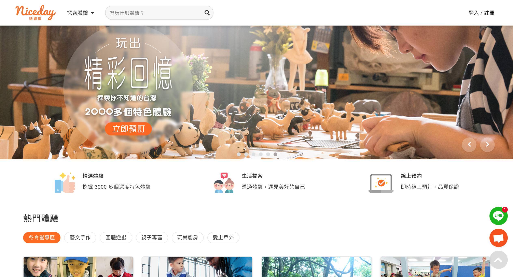
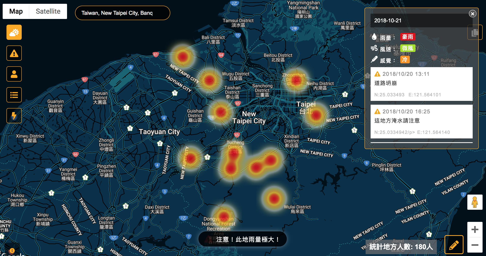

Fang Chung-Chueh
============

-------------------     ----------------------------
Experienced programmer on `front-end development`. Focused on building rock solid, beautiful, accessible websites and have `3+ years` of experiences. Specialized in `Javascript` and `ReactJs`.
-------------------     ----------------------------

Education
----------
2010-2014<br>
**Bachelor’s in Visual Communication Design**; Kunshan University

Skills
----------
**Front-end**
- HTML
- CSS
- Javascript
- React
- React Native
- Redux
- Vue
- Jest

**Back-end**
- NodeJs
- GraphQL(Apollo)
- Python(Beginning)

Experience
----------
<small>2017/11 - Now</small><br>
**Sr.Frontend Engineer - Niceday**

- Daily active user 12,000 on the web app.

- Introduced and adopted techniques such as ReactJS, Redux, recompose, styled-components, GraphQL(Apollo), NodeJs, into our team.
- Redesign existing project with the designer to the best user experience.
- Refactoring project architecture to increase performance.
- Writing Unit Tests and End-to-End Tests.
- Manipulate and analyze data in GraphQL.
- Participating in full life cycle of product development.

```jsx
const enhance = compose(
    Redesign,
    Refactoring,
    Testing,
)
const fetch = gql`
    tools{
        React
        Redux
        GraphQL
    }
`
const Niceday = ({ doing }) => <div>{doing}</div>
export default enhance(Niceday)
```
<small>2017/04 - 2017/11</small><br>
**Frontend Engineer - Gsailors**

- Developed web applications by using Vue.js and Vuex.
- Improved the workflow and shorten time-to-market.
- Running an agile software development.

```jsx
	Vue.component('Answerme', {
		data: function () {
			return {
			text: 'Vue'
			}
		},
		template: 'Hello {{ text }}'
	})
```

<small>2016/04 - 2017/02</small><br>
**Frontend Engineer - Intentarget**

- Conducted social media platform web development by using React.
- Developed news mobile app by using React Native.
- Integrated third-party APIs such as Facebook and Google into the web applications.

```js
    class Intentarget extends React.Component{
        render(){
            return <div>Hello React</div>
        }
    }
```

<small>2012/08 - 2013/05</small><br>
**Frontend(Intern) - 法樂數位創意**
- Cooperated with colleagues on Yahoo、Knorr and Luxgen projects.
- Knew more about web knowledge.

```html
    <div>
    	<p style="">Amazing Web</p>
    </div>
```

Projects
----------
- **[Niceday](https://play.niceday.tw/)**

<br>
- **[Answerme](https://www.answerme.com.tw/)**

<br>
- **[NASA Hackathon 2018](http://jweiwu.pythonanywhere.com/)**

<br>


